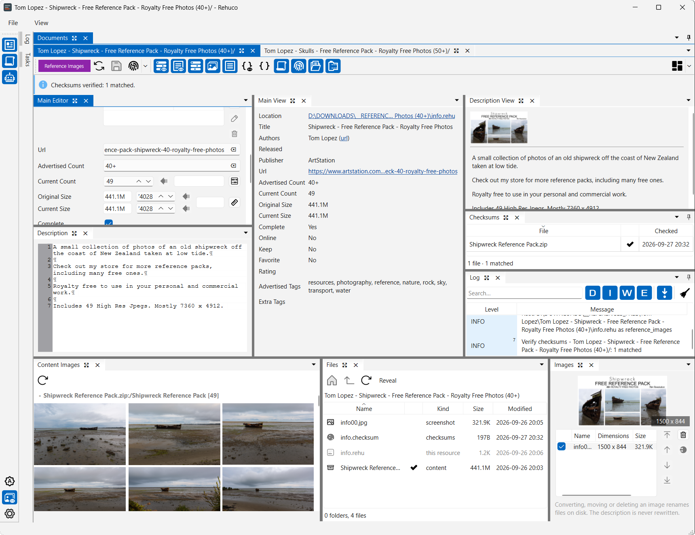

# rehuco

A personal media catalog for the things you collect to learn from and work with — video tutorials,
online courses, archives of reference images. Today it is the part that comes first: a desktop editor
for a resource's **details**, not for the media itself.

Those details live in a small JSON file — a `.rehu` — sitting in the folder next to the resource it
describes, one per resource. That's the whole storage model, and the name is its stem.

**[How it works](specs/how-it-works.md)** is one page on the whole system as it stands: the file, the
rules that keep it trustworthy, the app's panels, and what isn't built.

## What it does

- **Edits a resource's details.** Open a `.rehu` from the file manager or from the app: title,
  authors, publisher, release date, URL, durations, sizes, rating, level, tags, flags, and a Markdown
  description.
- **Fills those fields from a dropped page.** Drop a URL — ArtStation, Udemy, or a user's own scraper
  script — on the editor to scrape it, and review the result as an ordinary edit before saving.
- **Shows its screenshots.** A thumbnail strip beside the fields — double-click one to fill the window,
  arrow keys or the wheel to move through the set, and pick which of them the strip shows. A reference
  pack also shows the images inside its archives.
- **Checks its files.** Generates and verifies checksums for one resource or a whole folder, remembering
  when each file was last checked so a re-run skips what is still fresh.
- **Converts legacy `.tc` catalogs.** One file or a whole folder tree at once: reads the older format,
  writes `.rehu`, and keeps backups it can roll back if the conversion goes wrong.
- **Works in the background.** Checksums, imports and scrapes run on a task queue you can pause,
  reorder and cancel, with a log beside it.
- **Doesn't damage what it doesn't understand.** Unrecognized fields survive a save untouched, and a
  file written by a newer version of the format opens read-only rather than being rewritten.
- **Keeps your workspace.** Atomic saves, and each file's panel layout remembered between sessions.
- **Rebinds its shortcuts.** A Shortcuts page in Settings lists every command: search by name,
  description or key, press a key to record it, give a command several keys, and choose where they reach.
  A key another command already uses is offered to reassign.

Self-describing by design: a `.rehu` sits next to the content it describes, so reading a resource's
details needs nothing but the file itself — no index, no server, no account.

Tested on Windows, macOS, and Linux.

## Where it's going

What's left of the editor is small: a page image picker (a scraping helper, not an editor feature).

The next real piece is **a basic browser**: a view over a folder of resources, a rebuildable cache with
search, so a collection can be looked through rather than opened one file at a time. See the
[implementation plan](specs/implementation-plan.md).

Past that point the design reaches further — playback with progress tracking, a headless node with a
REST API, sync and offline borrowing between machines, multi-user access rules, a browser interface,
Daz3D library migration. None of it is implemented, none of it is scheduled, and some of it may never
be: it is what the architecture is shaped to allow, and each piece has to earn its place when its turn
comes. The [design specs](specs/README.md) explore that territory in depth — as intent, not as a
description of the current build.

Maintenance is tracked separately under the **`audit`** label — it collects the issues found during a
codebase audit, one sweep at a time.

## rehuco packages

rehuco is published as three separate packages on PyPI, all at an early stage — published so the
names are taken and the release plumbing is exercised, not because they are ready to depend on.

| Package | Description | PyPI | Downloads | Python |
| --- | --- | --- | --- | --- |
| [rehuco-agent](https://pypi.org/project/rehuco-agent/) | PySide6 desktop GUI |  |  |  |
| [rehuco-core](https://pypi.org/project/rehuco-core/) | Shared library: models, `.rehu` I/O, legacy `.tc` reading |  |  |  |
| [rehuco-node](https://pypi.org/project/rehuco-node/) | A reserved name; no service written yet |  |  |  |

## Generic libraries (temporarily hosted)

Two generic, reusable libraries under the author's `borco` namespace are **not rehuco-specific**. They are
developed in this monorepo for now and will later move to their own repository. If you install them from PyPI,
that move is handled automatically.

| Package | Description | PyPI | Downloads | Python |
| --- | --- | --- | --- | --- |
| [borco-core](https://pypi.org/project/borco-core/) | Generic reusable classes with no GUI dependency |  |  |  |
| [borco-pyside](https://pypi.org/project/borco-pyside/) | Generic reusable PySide6/Qt classes (e.g. `ApplicationSingleton`) |  |  |  |
