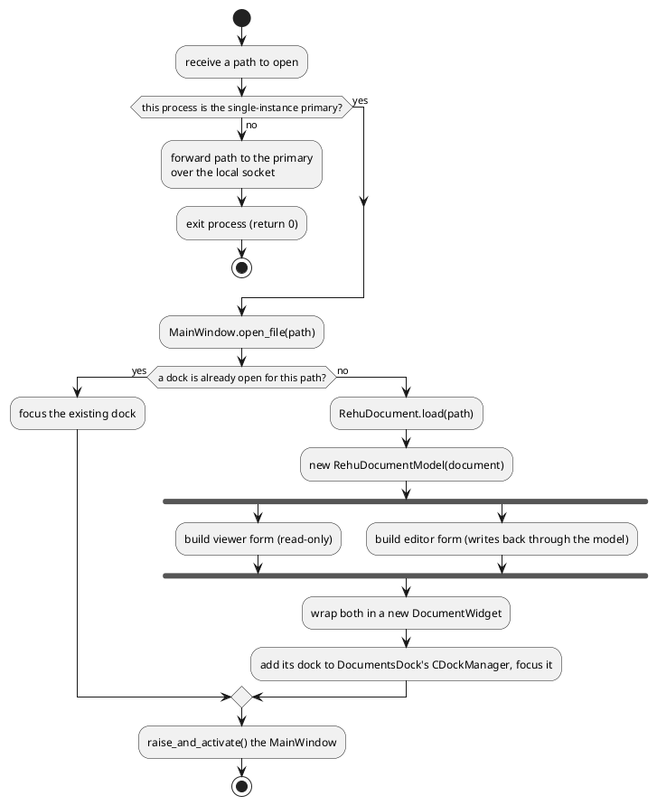

# Activity diagram: opening one path

The same flow as [sequence-open-document.md](sequence-open-document.md), reframed around its
decision points rather than which object calls which. The fork/join reflects
`DocumentWidget.__init__` (`document_widget.py:38-40`): the viewer and editor forms are both
built, from the same `RehuDocumentModel`, regardless of which dock ends up visible.

## PlantUML

