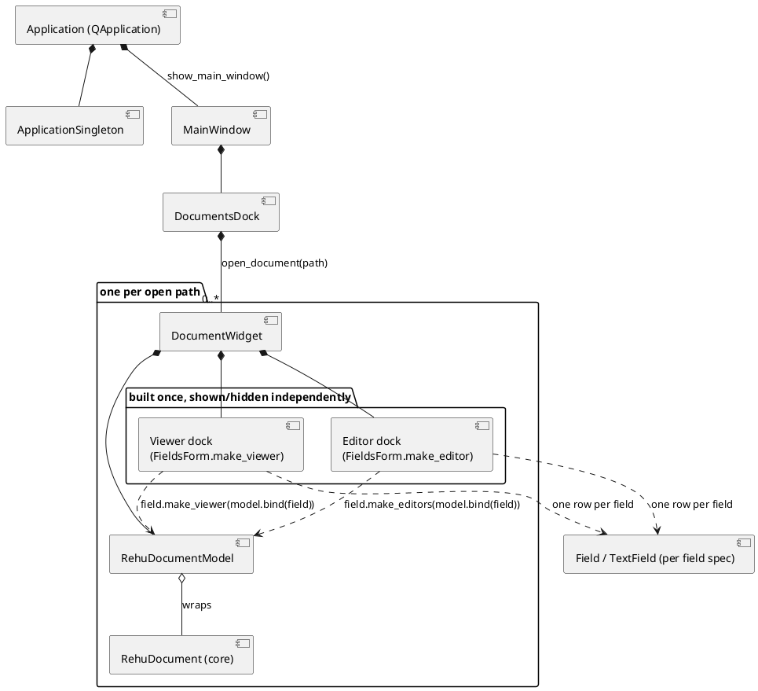

# Component diagram: containment hierarchy

[[[component-decomposition]]]

The "what's inside what" view, from the single `Application` down to one field's widgets. Each
level is a real containment relationship in the code, not just a call:
`Application.show_main_window()` builds exactly one `MainWindow`
(`app.py:55-63`); `DocumentsDock` holds one `DocumentWidget` per open path
(`documents_dock.py:26`); `DocumentWidget` builds a viewer dock and an editor dock from the same
`FieldsForm` (`document_widget.py:38-40`) -- the [[plugins#viewer-editor-both]] surfaces.

