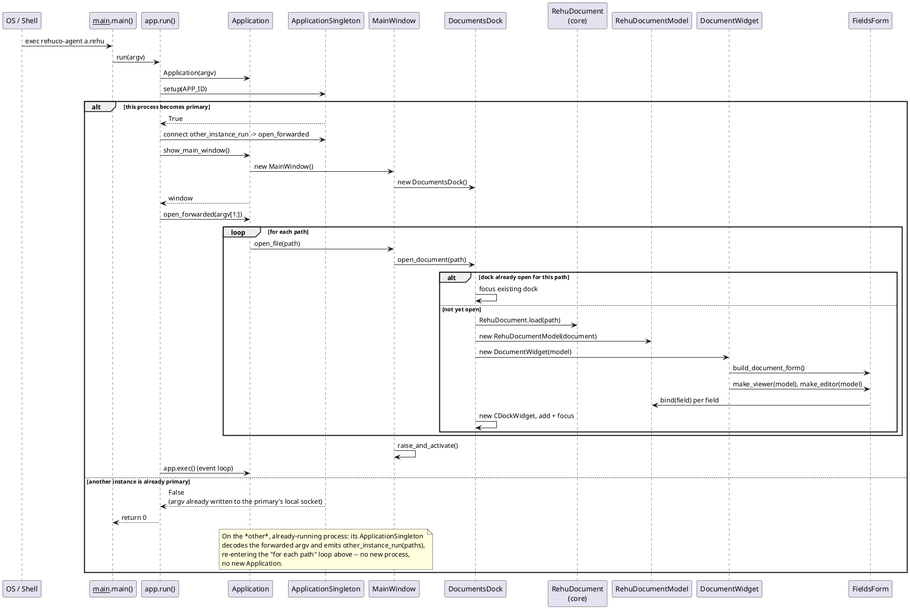

# Sequence diagram: opening a `.rehu` path

[[[sequence-open-document]]]

Traces `packages/rehuco-agent/src/rehuco_agent/__main__.py`'s `main()` through `app.py`'s `run()`
(`app.py:73-94`) down to a new dock appearing, covering both cases `run()` handles: this process
becomes the single-instance primary, or another primary is already running and this process
just forwards its argv and exits ([[nodes#single-instance]]). Builds the [[plugins#dock-shell]]
described in prose.

